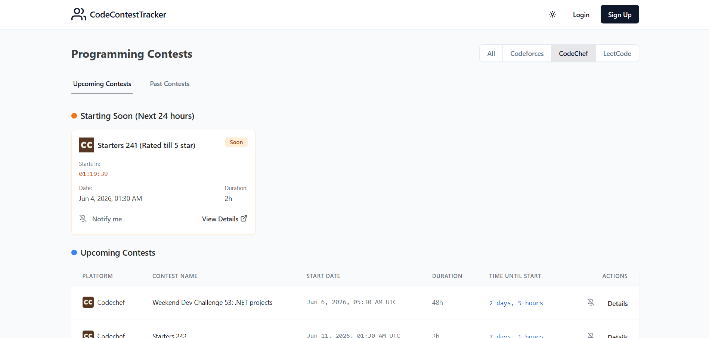

# 🏆 ContestTrack

[](https://contesttrack-zux7.onrender.com/)
[]()
[]()
[]()

A full-stack web application designed for competitive programmers to track, filter, and set automated reminders for upcoming coding contests across various platforms (Codeforces, LeetCode and CodeChef). 

**Live Demo:** [https://contesttrack-zux7.onrender.com/](https://contesttrack-zux7.onrender.com/)

---

## 📸 Preview



---

## ✨ Features

- **Live Contest Tracking:** Fetches real-time data for upcoming and ongoing coding contests using the CLIST API.
- **Personalized Dashboard:** Filter contests by your favorite platforms (LeetCode, Codeforces, GeeksforGeeks, CodeChef, etc.).
- **Email Reminders:** Mark contests you want to participate in and receive automated email notifications before they start.
- **User Authentication:** Secure signup and login system to save your preferences and marked contests.
- **Modern UI/UX:** Responsive design with Light/Dark mode toggles, built with Tailwind CSS and shadcn/ui.

## 🛠️ Tech Stack

**Frontend:**
- React (Vite)
- Tailwind CSS
- shadcn/ui
- React Query (Data Fetching)

**Backend:**
- Node.js & Express.js
- PostgreSQL (Neon DB)
- Drizzle ORM
- node-cron & nodemailer (Automated Email Services)

## 🚀 Getting Started (Local Development)

### Prerequisites
- Node.js (v18 or higher)
- A PostgreSQL Database (e.g., Neon DB)
- A CLIST API Key ([Get it here](https://clist.by/api/v4/doc/))

### Installation

1. **Clone the repository:**
   ```bash
   git clone https://github.com/DivyanshSaharan/ContestTrack.git
   cd ContestTrack
   ```

2. **Install dependencies:**
   ```bash
   npm install
   ```

3. **Set up Environment Variables:**
   Create a `.env` file in the root directory and add the following:
   ```env
   # Database
   DATABASE_URL=postgresql://<user>:<password>@<host>/<db>?sslmode=require

   # CLIST API (For fetching contests)
   CLIST_API_KEY=your_api_key_here
   CLIST_USERNAME=your_username_here

   # Security
   SESSION_SECRET=your_random_secret_string

   # Email Configuration (For reminders)
   EMAIL_USER=your_email@gmail.com
   EMAIL_PASS=your_app_password
   EMAIL_FROM="ContestTrack <your_email@gmail.com>"
   EMAIL_HOST=smtp.gmail.com
   EMAIL_PORT=587
   ```

4. **Initialize the Database:**
   Push the schema to your remote PostgreSQL database using Drizzle:
   ```bash
   npm run db:push
   ```

5. **Start the Development Server:**
   ```bash
   npm run dev
   ```
   The app will be running at `http://localhost:5000`.

## 📦 Deployment

This project is configured for easy deployment on **Render**. 
- Set the build command to: `npm install --include=dev && npm run build`
- Set the start command to: `npm run start`
- Ensure all environment variables are added to the Render dashboard.

